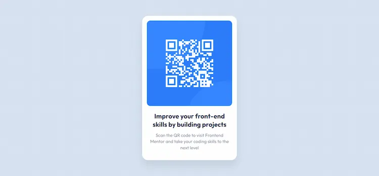

# Frontend Mentor - QR code component solution

This is a solution to the [QR code component challenge on Frontend Mentor](https://www.frontendmentor.io/challenges/qr-code-component-iux_sIO_H). Frontend Mentor challenges help you improve your coding skills by building realistic projects. 

## Table of contents

- Overview
  - Screenshot
  - Links
- My process
  - Built with
  - What I learned
  - Continued development
  - Useful resources
- Author
- Acknowledgments


## Overview

After completing this challenge, I felt a small but meaningful sense of accomplishment. Earlier in my development journey, I never experienced this feeling, so finishing this challenge motivated me to continue learning and improving.

### Screenshot



### Links

- Solution URL: (https://github.com/EngrMehwishMughal/QR-CODE-COMPONENT-MAIN)

- Live site URL: (https://engrmehwishmughal.github.io/QR-CODE-COMPONENT-MAIN/)


## My process

I first completed the HTML structure and then focused on styling with CSS to meet the challenge requirements. I followed a mobile-first approach and gradually refined the layout and design.

### Built with

- Semantic HTML5 markup
- CSS custom properties
- Flexbox
- Mobile-first workflow

### What I learned

Through this project, I practiced my basic understanding of HTML and CSS by applying them in a real task. I also learned the importance of a mobile-first workflow.

Additionally, I learned how to:
-Manage files effectively in the VS Code editor
-Create and structure a Markdown (README.md) file
-Understand and follow Figma designs for professional learning and growth

```html
<main class="container">
  <div class="card">
    <div class="qr-box">
      
    </div>
    <h1>Improve your front-end skills by building projects</h1>
    <p>
      Scan the QR code to visit Frontend Mentor and take your coding skills to the next level
    </p>
  </div>
</main>

```css
.container {
  min-height: 100vh;
  display: flex;
  justify-content: center;
  align-items: center;
}
.card {
  background-color: hsl(0, 0%, 100%);
  width: 320px;
  padding: 16px;
  border-radius: 20px;
  text-align: center;
  box-shadow: 0 20px 25px rgba(0, 0, 0, 0.08);
}

### Continued development

In future projects, I want to continue improving my HTML and CSS skills, especially in building more responsive layouts. I plan to practice Flexbox more and start learning CSS Grid for more complex layouts.

I also aim to:

-Write cleaner and more maintainable code
-Improve accessibility practices
-Gain more confidence in understanding Figma design files
-Strengthen my workflow using Git and GitHub
-Gradually move toward JavaScript to add interactive features

### Useful resources 

- [Frontend Mentor](https://www.frontendmentor.io/learning-paths/getting-started-on-frontend-mentor-XJhRWRREZd) - This platform guided me in building real-world projects through hands-on practice.
- [ChatGPT](https://chatgpt.com) - This tool supported me like a mentor and guided me whenever I got stuck.


## Author

- Frontend Mentor - [@EngrMehwishMughal](https://www.frontendmentor.io/profile/EngrMehwishMughal)


## Acknowledgments

I would like to express my sincere gratitude to Frontend Mentor for inspiring me to participate in these challenges and helping me regain confidence. After many unsuccessful attempts in the past, these challenges motivated me to keep going, improve my skills, and not give up. This journey has been a valuable and encouraging learning experience for me.


